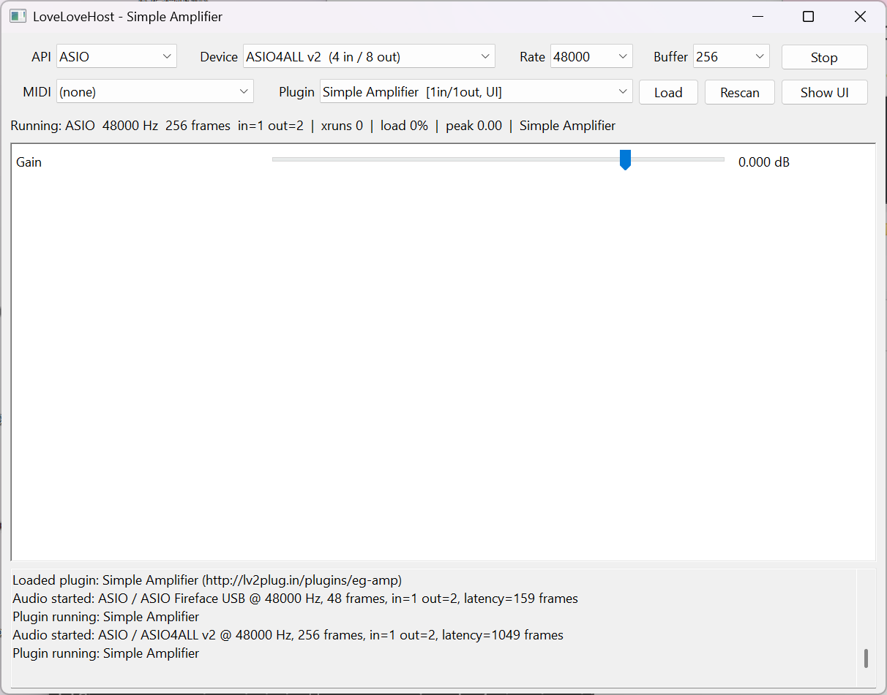

# LoveLoveHost

Windows 用のスタンドアロン LV2 プラグインホストです。LV2 プラグインを 1 つだけロードし、
ASIO(または WASAPI)デバイスに接続して動かします。



- LV2 ロード: [lilv](https://drobilla.net/software/lilv)
- オーディオ: [RtAudio](https://github.com/thestk/rtaudio)(ASIO / WASAPI)
- MIDI 入力: [RtMidi](https://github.com/thestk/rtmidi)(Windows MM)
- GUI: Win32 API 直接(汎用コントロールパネル + プラグイン独自 UI(`ui:WindowsUI`)の埋め込み)
- 設定(デバイス、バッファサイズ、プラグイン URI など)は `%APPDATA%\LoveLoveHost\config.json` に保存。
  プラグイン内部状態は保存しません。
- ログは `%APPDATA%\LoveLoveHost\LoveLoveHost.log` にも書き出されます。

## ビルド

前提: Visual Studio 2022(C++ ワークロード)、CMake 3.21+、git、vcpkg(`D:\prj\vcpkg` を想定)。

```powershell
# vcpkg が無い場合
git clone https://github.com/microsoft/vcpkg.git D:\prj\vcpkg
D:\prj\vcpkg\bootstrap-vcpkg.bat -disableMetrics

# 依存ライブラリ(lilv/lv2/serd/sord/sratom/zix/rtaudio[asio]/rtmidi/nlohmann-json)の取得とビルド
cmake --preset vs2022
cmake --build --preset release
```

vcpkg の場所が異なる場合は `CMakePresets.json` の `VCPKG_ROOT` を変更するか、環境変数 `VCPKG_ROOT` を設定してください。

出力は `build\bin\` に入ります(`LoveLoveHost.exe`、依存 DLL、テスト用プラグイン `lv2\*.lv2`)。

ASIO SDK について: RtAudio のソースツリーに ASIO SDK のヘッダが同梱されているため、別途ダウンロードは不要です。
Steinberg のライセンス条件が適用されます。

## 使い方

```
LoveLoveHost.exe [plugin-uri] [--lv2-path <dir>]... [--api <name>] [--device <name>] [--show-ui] [--run-seconds <n>]
```

1. `API` で ASIO / WASAPI を選び、`Device`、`Rate`、`Buffer` を選択して `Start`。
   ASIO のバッファサイズはドライバ側の設定が優先されるため、要求値と異なる場合があります(ステータス行に実際の値を表示)。
2. `Plugin` で LV2 プラグインを選び `Load`。コントロールポートがスライダー/チェックボックス/コンボとして並びます。
3. プラグインが `ui:WindowsUI` を持つ場合、`Show UI` で独自 UI を別ウィンドウに表示します。
4. `MIDI` で MIDI 入力ポートを選ぶと、Atom/MIDI 入力ポートを持つプラグイン(インストゥルメント等)にイベントが渡ります。

プラグイン検索パス: `--lv2-path`、実行ファイルと同じ場所の `lv2\`、環境変数 `LV2_PATH`  
(環境変数未設定の場合 `%APPDATA%\LV2` (C:\Users\ユーザ名\AppData\Roaming\LV2)と `%COMMONPROGRAMFILES%\LV2` (C:\Program Files\Common Files\LV2))。

### スモークテスト

```powershell
cd build\bin
.\LoveLoveHost.exe http://lv2plug.in/plugins/eg-amp --show-ui --run-seconds 5
type %APPDATA%\LoveLoveHost\LoveLoveHost.log
```

## 対応している LV2 機能

- ポート: Audio / Control / CV(ゼロ入力)/ Atom(Sequence)
- Features: `urid:map` / `urid:unmap`、`options:options`(block length、sequenceSize、sampleRate)、
  `bufsz:boundedBlockLength` / `nominalBlockLength` / `powerOf2BlockLength`、`worker:schedule`、`log:log`
- UI: `ui:WindowsUI`、`ui:parent`、`ui:resize`、`ui:idleInterface`、`ui:portMap`、`ui:portSubscribe`、
  `instance-access`、`data-access`、`atom:eventTransfer`(UI ⇄ プラグインの Atom 転送)
- 未対応: `state:interface` の保存/復元、プリセット、`time:Position`、X11/Gtk/Qt 系 UI

## 構成

```
src/
  main.cpp              エントリ(wWinMain)、引数処理
  util/                 RingBuffer(SPSC)、Config(JSON)、Log
  lv2/Lv2World          lilv ワールド、プラグイン列挙
  lv2/Lv2Plugin         インスタンス化、ポート接続、run()、worker スレッド、UI との Atom 転送
  lv2/Lv2Ui             ui:WindowsUI のロードと埋め込み
  audio/AudioEngine     RtAudio ストリーム管理、コールバック
  audio/MidiInput       RtMidi 入力 → リングバッファ
  gui/MainWindow        Win32 メインウィンドウ、汎用パネル、プラグイン UI ウィンドウ
examples/               LV2 公式サンプル(eg-amp/eg-midigate/eg-fifths/eg-params)のビルドと、
                        eg-amp 用テスト UI(amp-ui)
```

内部名(CMake ターゲット、ソースファイル名、クラス名、ウィンドウクラス名)は `lovehost` のままです。
